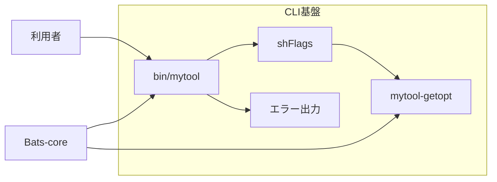

# 設計判断

## 目的

この設計は、macOSに標準搭載されたBash 3.2とLinuxのBashで、同じCLI動作、安全な入力処理、再現できるテスト環境を実現します。

## 構成

`bin/mytool`は依存されるモジュールから順に読み込み、最後に`cli::run`を呼び出します。各モジュールは一つの機能を担当します。

このリポジトリはCLI基盤だけを提供し、製品固有の機能を含みません。実際のCLIは、対象となる機能を機能単位のディレクトリへ実装し、`cli::run`から呼び出します。

## 基盤として採用している要素

| 要素 | 取り込み方 | 基盤での役割 |
|---|---|---|
| Bash3 Boilerplate | 厳格なシェル設定、安全なパス解決、終了状態を保つ考え方を適用します。 | Bashスクリプトを予測できる状態で開始し、失敗を呼び出し元へ正しく返します。 |
| shFlags | 1.3.0を`vendor/shflags`へ格納し、安全な変数代入を適用します。 | オプションの型、既定値、短い名前、長い名前を定義します。 |
| Bats-core | 1.14.0をGitサブモジュールとして固定します。 | 正常系、異常系、移植性、安全性を自動テストで確認します。 |
| 名前空間 | 関数名に`feature::command-name`形式を適用します。 | 関数の所属と役割を明確にし、名前の衝突を防ぎます。 |

## 関数実装時の参照先

次の要素は、プロジェクト全体を実行依存として読み込む基盤ではありません。機能の要件が発生したときに、必要な関数や実装方法を個別に確認するための参照先です。

| 参照先 | 主な参照範囲 | 取り込み規則 |
|---|---|---|
| Lobash | 文字列操作、配列操作、条件判定の関数設計を参照します。 | Bash 3に対応しないコードは転用せず、必要な振る舞いをBash 3.2互換の関数として実装します。 |
| bash-commons | ログ、入力検査、OS判定、ファイル操作の責務分割を参照します。 | 同じ責務の関数が存在しないことを確認し、必要な処理だけを機能単位で取り込みます。 |
| Pure Bash Bible | 外部コマンドを使わない文字列処理やパス処理の実装方法を参照します。 | 必要な処理をBash 3.2の組み込み機能で構成し、対象の正常系と異常系をテストします。 |

参照先からコードを取り込む場合は、対象コードのライセンスと著作権表示を確認し、由来を記録します。取り込んだ関数には本プロジェクトの命名規則、Bash 3.2互換性、ShellCheck、自動テストを適用します。

## 引数解析

macOSの標準`getopt`は長いオプションと空白を含む値を扱えません。Linuxで一般的なGNU `getopt`は両方を扱います。`libexec/mytool-getopt`は、この差を吸収し、次の規則を両方のOSへ適用します。値を取るオプションは、製品固有の機能が使用する場合の形式を示します。

| 入力形式 | 動作 |
|---|---|
| `-f path` | 短いオプションと次の値を解析します。 |
| `-fpath` | 短いオプションと連結した値を解析します。 |
| `--file path` | 長いオプションと次の値を解析します。 |
| `--file=path` | 長いオプションと連結した値を解析します。 |
| `-vh` | 値を取らない短いオプションを分割します。 |
| `--` | 以後の入力を位置引数として扱います。 |

shFlagsの文字列代入は、Bashの`printf -v`を使用します。利用者の値に単一引用符やコマンド置換の形が含まれても、その値をシェルコードとして評価しません。

## 入力検査

| 対象 | 規則 | 誤りの終了状態 |
|---|---|---|
| オプション名 | 定義済みの名前だけを受け付けます。 | 2 |
| 位置引数 | 受け付けません。 | 64 |

## 依存管理

shFlagsは実行時に必要なため、ソースとライセンスを`vendor/shflags`へ格納します。安全な代入処理の差分は`vendor/shflags/PATCHES.md`に記録します。

Bats-coreは開発時だけ必要なため、Gitサブモジュールとして`vendor/bats-core`へ格納します。GitのコミットIDが依存バージョンを固定します。

## テスト方針

| 分類 | 確認内容 |
|---|---|
| 正常系 | 既定のヘルプ、長短のヘルプオプション、長短のバージョンオプションを確認します。 |
| 異常系 | 位置引数、未知の長短オプション、値の欠落、論理値オプションへの値指定を確認します。 |
| 移植性 | 空白と単一引用符を含む値を引数アダプターで確認します。 |
| 安全性 | コマンド置換の形を通常の文字列として扱うことを確認します。 |
| 単体 | 引数アダプターを個別に確認します。 |

継続的インテグレーションはUbuntuとmacOSで静的検査と全テストを実行します。
