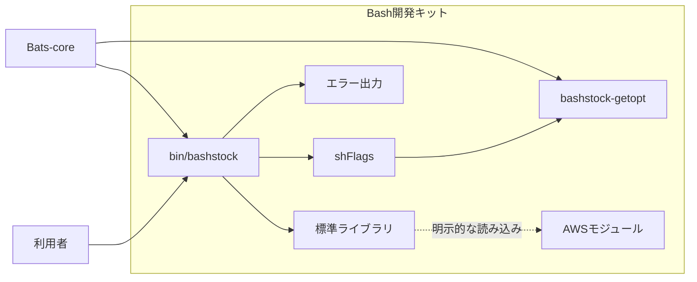

# 設計判断

## 目的

この設計は、Apple Siliconを含むmacOSに標準搭載されたBash 3.2、Ubuntu 18.04以降、Fedoraで、同じCLI動作、安全な入力処理、再現できるテスト環境を実現します。

## 構成

`bin/bashstock`は、BashStockの読み込みと設定を確認するCLIです。`src/library.sh`から標準ライブラリを依存順に読み込み、最後に`cli::run`を呼び出します。AWS機能は標準ライブラリに含めず、製品が必要なモジュールを明示的に読み込みます。

このリポジトリは、他のBashプロジェクトから第三者ライブラリとして読み込む開発キットです。標準ライブラリ、CLI構成、OS別処理、テスト環境を提供し、製品固有の機能を含みません。利用する製品は`src/library.sh`と必要な任意モジュールを読み込み、製品固有の処理を実装します。

## 基盤として採用している要素

| 要素 | 取り込み方 | 基盤での役割 |
|---|---|---|
| Bash3 Boilerplate | 厳格なシェル設定、安全なパス解決、終了状態を保つ考え方を適用します。 | Bashスクリプトを予測できる状態で開始し、失敗を呼び出し元へ正しく返します。 |
| shFlags | 1.3.0を`vendor/shflags`へ格納し、安全な変数代入を適用します。 | オプションの型、既定値、短い名前、長い名前を定義します。 |
| Bats-core | 1.14.0をGitサブモジュールとして固定します。 | 正常系、異常系、移植性、安全性を自動テストで確認します。 |
| 名前空間 | 関数名に`feature::command-name`形式を適用します。 | 関数の所属と役割を明確にし、名前の衝突を防ぎます。 |

## 関数の命名規則

本プロジェクトは、Rustの命名原則をBash向けの`namespace::kebab-case`形式へ適用します。Rustのスネークケースは使用せず、既存のシェル関数と同じケバブケースを使用します。

| 対象 | 規則 | 例 |
|---|---|---|
| 名前空間 | 対象領域を表す単数形の名詞を使用します。 | `array`、`string`、`path`、`time` |
| 値の取得 | 名詞または性質を使用し、`get-`を付けません。 | `system::host-name`、`path::extension` |
| 状態の述語 | `is-`で始め、終了状態で真偽を返します。 | `path::is-directory`、`shell::is-function-defined` |
| 存在の述語 | 対象自体の存在確認には`exists`を使用します。 | `command::exists` |
| 関係の述語 | 関係を表す動詞を使用します。 | `array::contains`、`string::starts-with` |
| 変換 | 動詞を先頭に置き、変換対象を後ろへ置きます。 | `string::encode-url`、`string::remove-prefix` |
| 数量 | 要素数と文字数には`length`、バイト数には`byte-length`を使用します。 | `array::length`、`string::length`、`string::byte-length` |
| 複数結果 | 複数形の名詞を使用します。 | `string::capture-groups` |
| 単位 | 省略せずに複数形で記載します。 | `time::monotonic-milliseconds`、`time::unix-seconds` |
| 対称な機能 | 概念と粒度を同じ語順で並べます。 | `time::utc-date-time-seconds`、`time::local-date-time-seconds` |

## 関数実装時の参照先

次の要素は、プロジェクト全体を実行依存として読み込む基盤ではありません。機能の要件が発生したときに、必要な関数や実装方法を個別に確認するための参照先です。

| 参照先 | 主な参照範囲 | 取り込み規則 |
|---|---|---|
| Lobash | 文字列操作、配列操作、条件判定、対話入力、時間取得の関数設計を参照します。 | [Lobashの関数選定](references/lobash.md)に採否と契約を記載します。 |
| bash-commons | ログ、入力検査、配列操作、文字列操作、ファイル操作、管理者実行、OS別利用者管理、AWS操作の責務分割を参照します。 | [bash-commonsの関数選定](references/bash-commons.md)に採否と契約を記載します。 |
| Pure Bash Bible | 外部コマンドを使わない文字列処理やパス処理の実装方法を参照します。 | 採用対象を次の表に限定し、Bash 3.2互換で実装します。 |

参照先からコードを取り込む場合は、対象コードのライセンスと著作権表示を確認し、由来を記録します。取り込んだ関数には本プロジェクトの命名規則、Bash 3.2互換性、ShellCheck、自動テストを適用します。

### Pure Bash Bibleから採用する関数

採用対象は次の表に限定します。参照元の振る舞いを、本プロジェクトの名前空間、引数規則、終了状態、Bash 3.2互換性に合わせて実装します。

| 本プロジェクトの関数 | 参照する関数または項目 | 関数の契約 | Bash 3.2での実装規則 | 必須テスト |
|---|---|---|---|---|
| `string::trim` | `trim_string` | 先頭と末尾の空白文字を除き、結果を標準出力へ書きます。 | `[[:space:]]`とパラメーター展開を使用します。 | 空文字、空白だけ、内側の空白、改行とタブ、日本語を確認します。 |
| `string::collapse-whitespace` | `trim_all` | 両端の空白文字を除き、内側で連続する空白文字をASCII空白一つへ変換します。 | 単語分割、パス名展開、シェルオプションの変更を使用せず、文字を順番に処理します。 | 空文字、空白だけ、複数種類の空白、パス名展開文字、内側の改行を確認します。 |
| `string::is-match` | `regex` | 文字列がPOSIX拡張正規表現に一致すれば終了状態0、一致しなければ1、正規表現が無効なら64を返します。標準出力へは書きません。 | `[[ value =~ expression ]]`を使用し、OS間で共通するPOSIX拡張正規表現だけを契約に含めます。 | 一致、不一致、空文字、無効な正規表現、正規表現記号を含む入力を確認します。 |
| `string::split` | `split` | 文字列を空でない区切り文字列で分割し、空の要素を保持して一要素ずつ標準出力へ書きます。改行を含む入力は終了状態64を返します。 | `readarray`、`mapfile`、連想配列を使用せず、パラメーター展開の反復処理で分割します。 | 一文字と複数文字の区切り、先頭と末尾の区切り、連続する区切り、区切りなし、空の区切り、改行を確認します。 |
| `string::lower` | `lower` | ASCII英大文字を小文字へ変換し、その他の文字を保持します。 | `${value,,}`を使用せず、ASCII文字を一文字ずつ判定して変換します。 | 大文字、小文字、大小混在、数字、記号、日本語、空文字を確認します。 |
| `string::upper` | `upper` | ASCII英小文字を大文字へ変換し、その他の文字を保持します。 | `${value^^}`を使用せず、ASCII文字を一文字ずつ判定して変換します。 | 小文字、大文字、大小混在、数字、記号、日本語、空文字を確認します。 |
| `string::swap-case` | `reverse_case` | ASCII英字の大文字と小文字を入れ替え、その他の文字を保持します。 | `${value~~}`を使用せず、ASCII文字を一文字ずつ判定して変換します。 | 大小混在、数字、記号、日本語、空文字を確認します。 |
| `string::strip-surrounding-quotes` | `trim_quotes` | 文字列全体を囲む同種の単一引用符または二重引用符を一組だけ除き、内側の引用符を保持します。 | 全引用符の置換を使用せず、先頭と末尾の文字を比較します。 | 単一引用符、二重引用符、引用符なし、片側だけ、異なる引用符、内側の引用符、空文字を確認します。 |
| `string::remove-all-matches` | `strip_all` | Bashのパターンに一致する部分をすべて除き、結果を標準出力へ書きます。 | Bash 3.2の`${value//pattern/}`を使用します。 | 一致なし、一件一致、複数一致、文字クラス、空文字、空のパターンを確認します。 |
| `string::remove-first-match` | `strip` | Bashのパターンに最初に一致する部分だけを除き、結果を標準出力へ書きます。 | Bash 3.2の`${value/pattern/}`を使用します。 | 一致なし、一件一致、複数一致、文字クラス、空文字、空のパターンを確認します。 |
| `string::remove-prefix` | `lstrip` | Bashのパターンに一致する最長の接頭部分を除き、結果を標準出力へ書きます。 | Bash 3.2の`${value##pattern}`を使用します。 | 一致なし、一致、文字列全体の一致、複数候補、空文字、空のパターンを確認します。 |
| `string::remove-suffix` | `rstrip` | Bashのパターンに一致する最長の接尾部分を除き、結果を標準出力へ書きます。 | Bash 3.2の`${value%%pattern}`を使用します。 | 一致なし、一致、文字列全体の一致、複数候補、空文字、空のパターンを確認します。 |
| `string::encode-url` | `urlencode` | UTF-8文字列をバイト単位でパーセント符号化し、非予約文字`A-Z`、`a-z`、`0-9`、`-`、`.`、`_`、`~`を保持します。 | `LC_ALL=C`の局所変数とBash 3.2の部分文字列展開を使用します。 | ASCII、空白、予約文字、パーセント記号、日本語、空文字を確認します。 |
| `string::decode-url` | `urldecode` | 正しい`%HH`をバイトへ戻します。`+`は空白へ変換しません。Bash変数で表現できないNULの`%00`と不正な符号化は終了状態64を返します。 | 入力を検証してからBash組み込みの`printf`で復号し、入力を書式文字列として使用しません。 | ASCII、空白、予約文字、日本語、`+`、`%00`、不完全な`%`、16進数以外、空文字を確認します。 |
| `string::contains` | 文字列が部分文字列を含むか確認する条件式 | 第一引数が第二引数を文字列として含めば終了状態0、含めなければ1を返します。標準出力へは書きません。 | 検索文字列をパターンとして評価せず、リテラル文字列として比較します。 | 一致、不一致、完全一致、空の検索文字列、パターン記号、空文字を確認します。 |
| `string::starts-with` | 文字列が部分文字列で始まるか確認する条件式 | 第一引数が第二引数で始まれば終了状態0、始まらなければ1を返します。標準出力へは書きません。 | 検索文字列をパターンとして評価せず、リテラル文字列として比較します。 | 一致、不一致、完全一致、空の検索文字列、パターン記号、空文字を確認します。 |
| `string::ends-with` | 文字列が部分文字列で終わるか確認する条件式 | 第一引数が第二引数で終われば終了状態0、終わらなければ1を返します。標準出力へは書きません。 | 検索文字列をパターンとして評価せず、リテラル文字列として比較します。 | 一致、不一致、完全一致、空の検索文字列、パターン記号、空文字を確認します。 |
| `path::directory-name` | `dirname` | パスのディレクトリ部分を標準出力へ書きます。 | 外部の`dirname`を呼び出さず、パラメーター展開で末尾の斜線と最後の要素を処理します。 | 相対パス、絶対パス、ルート、末尾の斜線、斜線なし、空文字、空白と改行を含むパスを確認します。 |
| `path::base-name` | `basename` | パスの最後の要素を標準出力へ書き、任意の接尾辞が一致する場合は一度だけ除きます。 | 外部の`basename`を呼び出さず、パラメーター展開で末尾の斜線、最後の要素、接尾辞を処理します。 | 相対パス、絶対パス、ルート、末尾の斜線、接尾辞の一致と不一致、空文字、空白と改行を含むパスを確認します。 |

各関数は、引数の個数が契約と異なる場合に終了状態64を返します。値を返す関数は結果だけを標準出力へ書き、述語関数は標準出力と標準エラー出力へ書きません。利用者の入力を`eval`へ渡さず、グローバル変数、現在のディレクトリ、`IFS`、ロケール、シェルオプションを呼び出し後に変更しません。

### Pure Bash Bibleから採用しない名前付き関数

次の名前付き関数は採用しません。一般的な構文、演算子、ループ、変数の使用例は独立した関数ではないため対象外です。

| 参照元の関数名 | 機能 | 不採用の理由 |
|---|---|---|
| `bar` | 完了率と表示幅から、端末上の進捗バーを描画します。 | 端末UIは製品固有の表示機能であり、標準ライブラリの文字列処理とパス処理に含めません。 |
| `bkr` | `nohup`でコマンドをバックグラウンド実行し、標準出力と標準エラー出力を破棄します。 | 外部コマンドの実行、プロセスの分離、出力の破棄を暗黙に行うため、安全な共通関数に含めません。 |
| `count` | グロブ展開後の引数の個数を出力し、ファイルまたはディレクトリを数えます。 | 一致しないグロブの扱いと対象範囲が呼び出し側のシェル設定に依存するため、件数取得の共通契約にしません。 |
| `cycle` | グローバル配列とインデックスを使い、配列要素の巡回または二値の切り替えを行います。 | 呼び出し間でグローバル状態を変更し、入力と出力だけで動作が決まらないため、共通関数に含めません。 |
| `date` | Bashの`printf`が持つ日時書式を使い、現在日時を出力します。 | Bash 3.2には同等の組み込み日時書式がなく、外部の`date`を呼ぶ実装はPure Bashの採用範囲から外れるためです。 |
| `do_something` | 関数宣言構文を説明するための処理例です。 | 固定された入力、出力、責務を持つユーティリティー関数ではありません。 |
| `extract` | 開始マーカーと終了マーカーの間にあるファイル行を出力します。 | 複数区間、入れ子、マーカー行を含めるかどうかの規則が用途ごとに異なるため、製品側の解析機能とします。 |
| `f` | 配列反転用の内部関数と、短縮した関数宣言を示す複数の例です。 | 独立した一つの契約を持たず、短縮構文は本プロジェクトの可読性規則にも合いません。 |
| `get_cursor_pos` | ANSI制御シーケンスを端末へ送り、現在のカーソル座標を読み取ります。 | 対話端末と端末エミュレーターに依存するTUI機能であり、非対話CLIの基盤に含めません。 |
| `get_functions` | `declare -F`を解析し、現在のシェルで定義された関数名を出力します。 | デバッグとシェル内省のための機能であり、利用者向けCLIの実行機能に含めません。 |
| `get_term_size` | `LINES`と`COLUMNS`を更新し、端末の行数と列数を出力します。 | 端末UI専用であり、`checkwinsize`シェルオプションへ作用するため、共通関数に含めません。 |
| `get_window_size` | ANSI制御シーケンスを端末へ送り、端末画面のピクセル寸法を読み取ります。 | 対応しない端末があり、タイムアウトと端末応答に依存するため、移植可能な標準ライブラリに含めません。 |
| `head` | ファイルの先頭から指定行数を読み取り、出力します。 | ファイルの行処理は製品要件に含まれず、標準コマンドと同名になるため、文字列処理とパス処理の共通関数に含めません。 |
| `hex_to_rgb` | 3桁または6桁の16進カラーコードをRGB値へ変換します。 | 色の変換は端末UIまたは製品表示の責務であり、標準ライブラリの共通処理に含めません。 |
| `is_hex_color` | 入力が3桁または6桁の16進カラーコードか検証します。 | 色専用の入力検査であり、製品固有の値検査に分類します。 |
| `lines` | `mapfile`でファイル全体を配列へ読み込み、行数を出力します。 | ファイル全体をメモリーへ保持し、Bash 4専用構文をBash 3.2へ書き直しても`lines_loop`と責務が重複するためです。 |
| `lines_loop` | ファイルを一行ずつ読み取り、行数を出力します。 | ファイル行数の取得は現在の標準ライブラリの文字列処理とパス処理に含まれず、改行で終わらない最終行の規則も製品要件に従うためです。 |
| `random_array_element` | `$RANDOM`を使い、引数で渡された配列要素から一つを選びます。 | 擬似乱数で再現性がなく、暗号学的な安全性もないため、汎用的な選択関数として提供しません。 |
| `read_sleep` | タイムアウト付きの`read`とプロセス置換を使い、外部の`sleep`を使わずに待機します。 | 待機用ファイル記述子とプロセス置換へ依存し、標準の`sleep`より契約が複雑になるため、共通関数に含めません。 |
| `remove_array_dups` | 連想配列のキーを使い、配列から重複要素を除きます。 | 元の実装は順序を保持せず、Bash 3.2向けの代替処理は性能特性が変わるため、配列APIの要件が確定していない基盤に含めません。 |
| `reverse_array` | `BASH_ARGV`と`extdebug`を使い、配列要素を逆順に出力します。 | `extdebug`とBashの互換モードに依存し、シェルオプションへ作用するため、状態を変更しない共通関数の規則に合いません。 |
| `rgb_to_hex` | RGBの三つの数値を6桁の16進カラーコードへ変換します。 | 色の変換は端末UIまたは製品表示の責務であり、標準ライブラリの共通処理に含めません。 |
| `tail` | ファイルの末尾から指定行数を読み取り、出力します。 | ファイルの行処理は製品要件に含まれず、標準コマンドと同名になるため、文字列処理とパス処理の共通関数に含めません。 |
| `to_upper` | 呼び出し元の変数を名前参照で受け取り、内容を大文字へ書き換えます。 | Bash 4の名前参照と大文字変換に依存し、呼び出し元の変数を変更します。値を標準出力へ返す`string::upper`と責務も重複します。 |
| `uuid` | `$RANDOM`を使い、UUID v4形式の文字列を生成します。 | 生成値が暗号学的に安全ではなく、識別子として必要な衝突耐性を保証できないため、共通関数として提供しません。 |

## 引数解析

macOSの標準`getopt`は長いオプションと空白を含む値を扱えません。Linuxで一般的なGNU `getopt`は両方を扱います。`libexec/bashstock-getopt`は、この差を吸収し、次の規則を両方のOSへ適用します。値を取るオプションは、製品固有の機能が使用する場合の形式を示します。

| 入力形式 | 動作 |
|---|---|
| `-f path` | 短いオプションと次の値を解析します。 |
| `-fpath` | 短いオプションと連結した値を解析します。 |
| `--file path` | 長いオプションと次の値を解析します。 |
| `--file=path` | 長いオプションと連結した値を解析します。 |
| `-vh` | 値を取らない短いオプションを分割します。 |
| `--` | 以後の入力を位置引数として扱います。 |

shFlagsの文字列代入は、Bashの`printf -v`を使用します。利用者の値に単一引用符やコマンド置換の形が含まれても、その値をシェルコードとして評価しません。

## 入力検査

| 対象 | 規則 | 誤りの終了状態 |
|---|---|---|
| オプション名 | 定義済みの名前だけを受け付けます。 | 2 |
| 位置引数 | 受け付けません。 | 64 |

## 依存管理

shFlagsは実行時に必要なため、ソースとライセンスを`vendor/shflags`へ格納します。安全な代入処理の差分は`vendor/shflags/PATCHES.md`に記録します。

時間関数は、OSごとに異なる`date`コマンドの機能へ依存しません。実行環境のPerl、`Time::HiRes`、`POSIX`を内部時計アダプターから使用し、スリープを除外する単調時計、スリープを含む起動後時計、Unix時刻、UTC日時、UTCオフセットを含むローカル日時をmacOS、Ubuntu、Fedoraで同じ形式にします。時間関数は実行時に依存モジュールを検査し、利用できない場合は終了状態69を返します。

Bats-coreは開発時だけ必要なため、Gitサブモジュールとして`vendor/bats-core`へ格納します。GitのコミットIDが依存バージョンを固定します。

## テスト方針

| 分類 | 確認内容 |
|---|---|
| 正常系 | 既定のヘルプ、長短のヘルプオプション、長短のバージョンオプションを確認します。 |
| 異常系 | 位置引数、未知の長短オプション、値の欠落、論理値オプションへの値指定を確認します。 |
| 移植性 | 空白と単一引用符を含む値を引数アダプターで確認します。時間関数は固定時計を使用し、macOS、Ubuntu、Fedoraで同じ出力と終了状態になることを確認します。 |
| 安全性 | コマンド置換の形を通常の文字列として扱うことを確認します。 |
| 単体 | 引数アダプターを個別に確認します。 |

継続的インテグレーションはmacOS、Ubuntu、Fedoraで静的検査と全テストを実行します。
