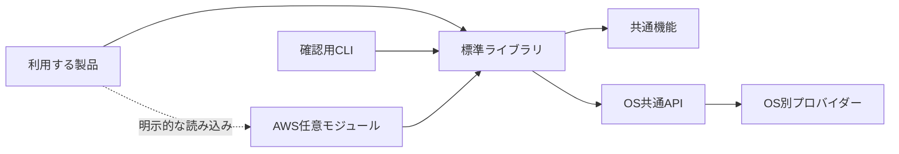

# BashStock設計

## 目的

BashStockは、他のBashプロジェクトから読み込む開発キットです。Apple Siliconを含むmacOS、Ubuntu 18.04以降、Fedoraで、同じ公開API、終了状態、出力形式を提供します。

製品固有の処理は含みません。利用する製品は標準ライブラリと必要な任意モジュールを読み込み、製品固有の処理を実装します。

## システム構成

標準ライブラリは`src/library.sh`を一度だけ読み込みます。読み込み時には、ネットワーク通信、権限昇格、利用者作成、ファイル更新を実行しません。この設計により、製品はライブラリの読み込みと副作用の実行を分離できます。

AWS機能は標準ライブラリに含みません。製品が必要なモジュールだけを明示的に読み込むため、AWS CLI、認証情報、ネットワークを使用しない製品へ不要な依存を持ち込みません。

## 設計原則

| 原則 | 最終設計 | 理由 |
|---|---|---|
| 実行環境 | Bash 3.2以上を使用します。 | macOS標準BashとLinuxのBashで同じコードを実行するためです。 |
| 依存方向 | 基礎的なモジュールを先に読み込み、上位モジュールから下位モジュールだけを呼び出します。 | 循環依存と読み込み順による動作差を防ぐためです。 |
| 入力の扱い | 利用者の入力をデータとして扱い、シェルコードとして評価しません。 | コマンド置換や引用符を含む入力から任意コードが実行されることを防ぐためです。 |
| 状態の保持 | 公開関数は呼び出し元のシェル状態を変更しません。 | ライブラリの呼び出しが製品の後続処理へ影響しないようにするためです。 |
| 任意機能 | 外部サービスを使う機能は個別モジュールに分離します。 | 不要な実行環境と副作用を標準ライブラリから除外するためです。 |
| OS差異 | 公開関数の内側でOS別プロバイダーを選択します。 | 製品側へOS分岐を持ち込まず、同じ公開APIを使用できるようにするためです。 |

## モジュールと依存順

`src/library.sh`は次の順番でモジュールを読み込みます。

| 順序 | モジュール | 責務 | 先に読み込む理由 |
|---|---|---|---|
| 基礎 | `console`、`number`、`string`、`regex`、`array` | 診断出力、数値、文字列、正規表現、配列を扱います。 | 他のモジュールが共通して使用するためです。 |
| 実行環境 | `system`、`command`、`shell`、`terminal`、`path` | OS、コマンド、シェル、TTY、パスを扱います。 | 対話処理、ファイル処理、OS処理の前提になるためです。 |
| 対話と時間 | `prompt`、`time`、`log` | 入力要求、時計、日時付きログを扱います。 | `prompt`は文字列とTTY、`time`は数値とOS、`log`は時間に依存するためです。 |
| データと更新 | `json`、`option`、`file` | 必須値、選択条件、ファイル検査と更新を扱います。 | 診断、文字列、パス、コマンドを利用するためです。 |
| OS処理 | `platform`、OS別プロバイダー、`user` | OS差異、利用者、所有者を扱います。 | 共通APIを確定してからOS固有実装を割り当てるためです。 |

AWSモジュールは標準ライブラリの読み込み後に使用します。Auto Scalingモジュールは、依存するIMDSモジュールとEC2モジュールを読み込みます。

## 名前空間の責務

| 名前空間 | 責務 | 分離する理由 |
|---|---|---|
| `console` | 利用者向け診断を標準エラー出力へ書きます。 | TTYの有無や日時付きログとは異なる責務だからです。 |
| `array` | 位置引数として受け取った要素列を処理します。 | Bash 3.2で安全な値渡しを使用し、配列名の間接参照を避けるためです。 |
| `number` | 数値述語と整数範囲検査を行います。 | 算術展開前の形式検査と上限検査を一か所へ集約するためです。 |
| `string` | 文字列の変換、分割、包含、一行値検査を行います。 | 配列やファイルに依存しない文字列処理を提供するためです。 |
| `regex` | 利用者が指定した正規表現を文字列へ適用します。 | リテラル文字列操作と正規表現操作を区別するためです。 |
| `system` | ホスト名とOS種別を取得します。 | 実行環境の識別をOS固有処理から分離するためです。 |
| `command` | コマンドの存在確認、必須条件、管理者実行を扱います。 | コマンド解決と権限昇格の規則を呼び出し側へ重複させないためです。 |
| `shell` | シェル関数の定義状態を判定します。 | 外部コマンドの存在確認とシェル内部の定義確認を区別するためです。 |
| `terminal` | 制御端末の存在と読み書き可能性を判定します。 | 標準入出力はファイルへリダイレクトでき、TTYと同一ではないためです。 |
| `path` | パスの判定、字句的な変換、設定ディレクトリ、所有者変更を扱います。 | ファイル内容の操作とパスそのものの操作を分離するためです。 |
| `prompt` | 入力要求と回答の解釈を行います。 | 表示、端末能力、業務上の再入力方針を分離するためです。 |
| `time` | 単調時計、起動後時計、日時、Unix時刻を提供します。 | 待機時間と実日時で使用する時計を明確に分離するためです。 |
| `log` | 日時、レベル、コマンド名を持つ運用記録を書きます。 | 単純な診断出力と記録形式を分離するためです。 |
| `json` | JSONから取得した値の存在条件を検査します。 | 一般的な空文字検査とJSONの`null`判定を区別するためです。 |
| `option` | 複数候補から一つだけ設定されたことを検査します。 | 製品ごとに同じ排他条件を実装しなくてよいようにするためです。 |
| `file` | ファイルの検査、追記、置換を行います。 | ファイルメタデータ、原子的更新、権限を一つの責務として扱うためです。 |
| `platform` | 公開APIからOS別実装を呼び分けます。 | OS固有コマンドを公開契約から隠すためです。 |
| `user` | 実効利用者の取得、存在確認、利用者作成を扱います。 | OSごとに異なるアカウント管理を共通APIから利用するためです。 |
| `aws` | IMDS、EC2、Auto Scalingの操作を扱います。 | 外部サービスへの依存を標準ライブラリから分離するためです。 |
| `cli` | 確認用CLIのオプション定義、検査、実行順序を管理します。 | ライブラリ機能と実行コマンドの制御を分離するためです。 |

## 関数名と可視性

公開関数は`namespace::kebab-case`形式で命名します。内部関数は`namespace::__kebab-case`形式で命名します。Bashには可視性を制限する機能がないため、二重アンダースコアによって非公開契約であることを示します。

| 対象 | 規則 | 例 |
|---|---|---|
| Docコメント | すべての製品コードの関数へ、責務を説明する英語の`###`コメントを記載します。 | `### Write the current host name.` |
| 名前空間 | 対象領域を表す単数形の名詞を使用します。 | `string`、`regex`、`path` |
| 値の取得 | `get-`を付けず、値を表す名詞を使用します。 | `system::host-name` |
| 状態の述語 | `is-`で始め、終了状態で真偽を返します。 | `path::is-directory` |
| 存在の述語 | `exists`を使用します。 | `command::exists` |
| 関係の述語 | 関係を表す動詞を使用します。 | `array::contains` |
| 変換 | 動詞を先頭に置きます。 | `string::encode-url` |
| 数量 | 要素数と文字数には`length`、バイト数には`byte-length`を使用します。 | `string::byte-length` |
| 複数結果 | 複数形を使用します。 | `regex::capture-groups` |
| 単位 | 単位を省略せず複数形で記載します。 | `time::unix-milliseconds` |

## 入出力と終了状態

値を返す関数は、結果だけを標準出力へ書きます。述語関数は、条件が成立すると終了状態0、成立しないと1を返し、標準出力と標準エラー出力へ書きません。診断は標準エラー出力へ書きます。

| 終了状態 | 意味 |
|---:|---|
| `0` | 処理に成功したか、述語の条件が成立しました。 |
| `1` | 述語の条件が成立しないか、検索対象が見つかりません。 |
| `2` | CLIのオプション解析に失敗しました。 |
| `64` | 引数の個数、形式、組み合わせが不正です。 |
| `66` | 入力ファイルまたは必要な入力元を利用できません。 |
| `69` | 必要なコマンド、モジュール、実行環境を利用できません。 |
| `73` | 利用者などの対象を作成できません。 |
| `74` | 入出力または状態の復元に失敗しました。 |
| `75` | 一時的な外部処理または待機が完了しません。 |
| `77` | 必要な権限を取得できません。 |

公開関数は`exit`を呼び出しません。呼び出し元が終了、再試行、継続を決定できるように、終了状態を返します。

## 正規表現の契約

正規表現の種類は名前空間では固定しません。正規表現を引数として受け取る各関数が、評価方式と評価範囲を契約として定義します。

| 関数 | 正規表現 | 評価範囲 |
|---|---|---|
| `regex::is-match` | Bashの`[[ =~ ]]`が解釈するPOSIX拡張正規表現 | 入力文字列 |
| `regex::capture-group` | Bashの`[[ =~ ]]`が解釈するPOSIX拡張正規表現 | 入力文字列 |
| `regex::capture-groups` | Bashの`[[ =~ ]]`が解釈するPOSIX拡張正規表現 | 入力文字列 |
| `file::contains-match` | Perlの`qr//`が解釈する正規表現 | ファイルの各行 |
| `file::replace-text` | Perlの`qr//`が解釈する正規表現 | 各行の最初の一致 |
| `file::replace-text-as-root` | Perlの`qr//`が解釈する正規表現 | 各行の最初の一致 |
| `file::replace-text-in-files` | Perlの`qr//`が解釈する正規表現 | 各ファイルの各行にある最初の一致 |
| `file::replace-text-in-files-as-root` | Perlの`qr//`が解釈する正規表現 | 各ファイルの各行にある最初の一致 |
| `file::replace-or-append-text` | Perlの`qr//`が解釈する正規表現 | 各行の最初の一致 |
| `file::replace-or-append-text-as-root` | Perlの`qr//`が解釈する正規表現 | 各行の最初の一致 |

ファイル置換関数の置換値はリテラル文字列として扱い、Perlコードや置換式として評価しません。数値や識別子の内部検査に使用する正規表現は利用者が指定しないため、公開APIの正規表現契約には含めません。

## シェル状態と入力の安全性

公開関数は、グローバル変数、現在のディレクトリ、`IFS`、ロケール、シェルオプション、呼び出し元の`BASH_REMATCH`を変更しません。一時的な設定は関数のローカル変数またはサブシェルに閉じ込めます。

利用者の入力は`eval`、動的な変数代入、動的なコマンド文字列へ渡しません。コマンド名を受け取る関数は、入力を検証してから配列化された位置引数として実行します。この設計により、空白、引用符、コマンド置換、パターン記号を通常の値として保持します。

## ファイル更新と権限

通常権限の関数は権限を昇格しません。管理者権限が必要な関数だけを`-as-root`で終わる名前にし、`command::run-as-root`から物理パスが確定した内部コマンドを実行します。

ファイル更新関数はシンボリックリンクを拒否します。既存ファイルは同じディレクトリの一時ファイルへ内容を作成してから原子的に置き換え、所有者、グループ、モード、ACL、拡張属性を保持します。複数ファイル更新では、全入力を検証してから更新し、途中で失敗した場合は保存した内容から復元します。

## OS別処理

`platform`名前空間は、macOS、Ubuntu、Fedoraで同じ内部関数を定義します。`src/library.sh`がOSを識別し、対応するプロバイダーだけを読み込みます。利用者作成、所有者変更、SHA-256計算などのOS差異は公開関数の内側へ閉じ込めます。

時間関数はGNU版とBSD版で異なる`date`のオプションに依存しません。Perlの`Time::HiRes`と`POSIX`を使用し、単調時計、起動後時計、Unix時刻、UTC日時、UTCオフセット付きローカル日時を同じ形式で返します。

## CLI

`bin/bashstock`は、ライブラリの読み込みと設定を確認するCLIです。shFlagsがオプションを定義し、`libexec/bashstock-getopt`がmacOSとLinuxの`getopt`差異を吸収します。

文字列オプションはBashの`printf -v`で代入します。入力値をシェルコードとして評価しないため、引用符やコマンド置換を含む値も安全に保持できます。

## 依存管理と検査

| 依存 | 管理方法 | 理由 |
|---|---|---|
| shFlags | `vendor/shflags`へソースとライセンスを格納します。 | 実行時に必要であり、安全な代入処理を固定するためです。 |
| Bats-core | Gitサブモジュールとして固定します。 | 開発時だけ使用し、同じテスト環境を再現するためです。 |
| Perl | OSの実行環境を使用します。 | 時刻とPerl正規表現をmacOSとLinuxで同じ契約にするためです。 |

`./bin/check`はBash構文検査、ShellCheck、自動テストを実行します。GitHub ActionsはmacOS、Ubuntu、Fedoraで同じ検査を実行します。固定応答のアダプターを使用するため、テストは実際のAWSアカウント、認証情報、IMDSへ接続しません。
