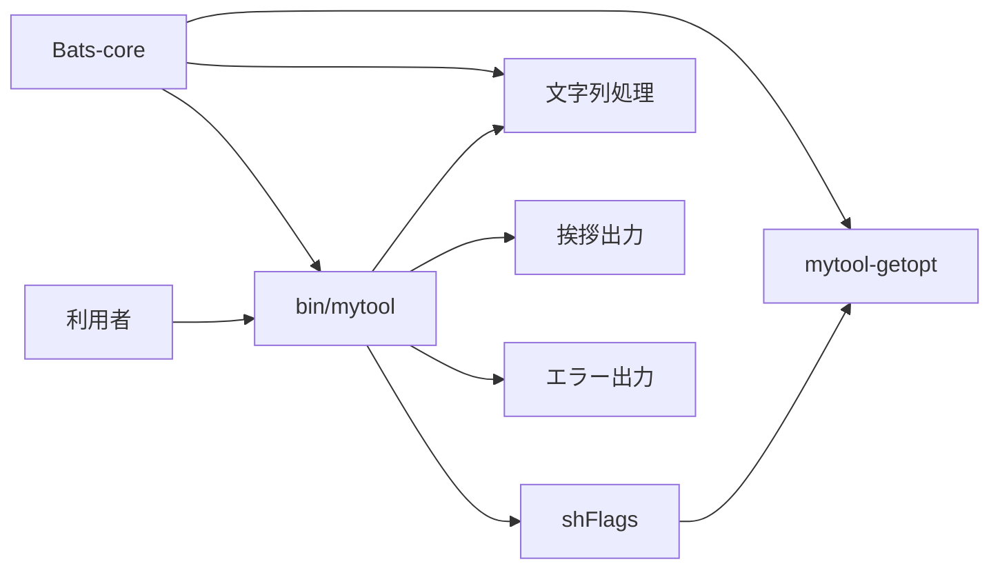

# 設計判断

## 目的

この設計は、macOSに標準搭載されたBash 3.2とLinuxのBashで、同じCLI動作、安全な入力処理、再現できるテスト環境を実現します。

## 構成

`bin/mytool`は依存されるモジュールから順に読み込み、最後に`cli::run`を呼び出します。各モジュールは一つの機能を担当します。

## AI案の評価結果

| 要素 | 本構成での位置づけ | 理由 |
|---|---|---|
| Bash3 Boilerplate | 厳格なシェル設定と安全なパス解決を適用します。 | 実在しない後処理や終了トラップを置かず、終了状態を正しく保ちます。 |
| shFlags | 1.3.0のオプション定義と解析機能を使用します。 | 定義処理の後に解析処理を実行します。 |
| Bats-core | 1.14.0をGitサブモジュールで固定します。 | 開発環境ごとの差を抑え、Bash 3.2でテストできます。 |
| 名前空間 | `feature::command-name`形式を使用します。 | 機能名と処理名を同時に示し、関数名の衝突を防ぎます。 |
| Lobash | 実行依存に含めません。 | LobashはBash 3を対象外とし、本構成の互換条件と一致しません。 |
| bash-commons | 実行依存に含めません。 | ログ、文字列、OS判定の範囲が小さなCLIには広く、独自モジュールと責務が重なります。 |
| Pure Bash Bible | 外部コマンドを減らす設計方針だけを適用します。 | 参照資料であり、読み込むライブラリではありません。 |

## 引数解析

macOSの標準`getopt`は長いオプションと空白を含む値を扱えません。Linuxで一般的なGNU `getopt`は両方を扱います。`libexec/mytool-getopt`は、この差を吸収し、次の規則を両方のOSへ適用します。

| 入力形式 | 動作 |
|---|---|
| `-n Alice` | 短いオプションと次の値を解析します。 |
| `-nAlice` | 短いオプションと連結した値を解析します。 |
| `--name Alice` | 長いオプションと次の値を解析します。 |
| `--name=Alice` | 長いオプションと連結した値を解析します。 |
| `-vh` | 値を取らない短いオプションを分割します。 |
| `--` | 以後の入力を位置引数として扱います。 |

shFlagsの文字列代入は、Bashの`printf -v`を使用します。利用者の値に単一引用符やコマンド置換の形が含まれても、その値をシェルコードとして評価しません。

## 入力検査

| 対象 | 規則 | 誤りの終了状態 |
|---|---|---|
| オプション名 | 定義済みの名前だけを受け付けます。 | 2 |
| `name` | 両端のASCII空白を除いた後に1文字以上を求め、制御文字を拒否します。 | 64 |
| `times` | 1から100までの整数を求めます。 | 64 |
| 位置引数 | 受け付けません。 | 64 |

出力行数に上限を設けることで、誤入力による過剰な出力を防ぎます。

## 依存管理

shFlagsは実行時に必要なため、ソースとライセンスを`vendor/shflags`へ格納します。安全な代入処理の差分は`vendor/shflags/PATCHES.md`に記録します。

Bats-coreは開発時だけ必要なため、Gitサブモジュールとして`vendor/bats-core`へ格納します。GitのコミットIDが依存バージョンを固定します。

## テスト方針

| 分類 | 確認内容 |
|---|---|
| 正常系 | 既定値、短いオプション、長いオプション、複数回出力を確認します。 |
| 境界値 | 回数の下限と上限を確認します。 |
| 異常系 | 空の名前、範囲外の回数、位置引数、未知のオプションを確認します。 |
| 移植性 | 空白を含む値と長いオプションを確認します。 |
| 安全性 | 単一引用符とコマンド置換の形を通常の文字列として確認します。 |
| 単体 | 文字列処理と引数アダプターを個別に確認します。 |

継続的インテグレーションはUbuntuとmacOSで静的検査と全テストを実行します。
