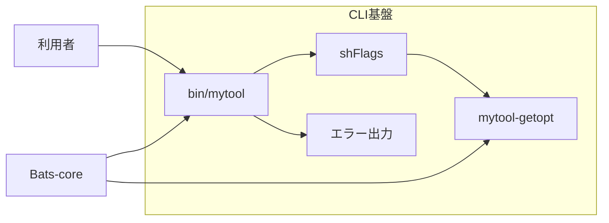

# 設計判断

## 目的

この設計は、macOSに標準搭載されたBash 3.2とLinuxのBashで、同じCLI動作、安全な入力処理、再現できるテスト環境を実現します。

## 構成

`bin/mytool`は依存されるモジュールから順に読み込み、最後に`cli::run`を呼び出します。各モジュールは一つの機能を担当します。

このリポジトリはCLI基盤だけを提供し、製品固有の機能を含みません。実際のCLIは、対象となる機能を機能単位のディレクトリへ実装し、`cli::run`から呼び出します。

## 基盤として採用している要素

| 要素 | 取り込み方 | 基盤での役割 |
|---|---|---|
| Bash3 Boilerplate | 厳格なシェル設定、安全なパス解決、終了状態を保つ考え方を適用します。 | Bashスクリプトを予測できる状態で開始し、失敗を呼び出し元へ正しく返します。 |
| shFlags | 1.3.0を`vendor/shflags`へ格納し、安全な変数代入を適用します。 | オプションの型、既定値、短い名前、長い名前を定義します。 |
| Bats-core | 1.14.0をGitサブモジュールとして固定します。 | 正常系、異常系、移植性、安全性を自動テストで確認します。 |
| 名前空間 | 関数名に`feature::command-name`形式を適用します。 | 関数の所属と役割を明確にし、名前の衝突を防ぎます。 |

## 関数実装時の参照先

次の要素は、プロジェクト全体を実行依存として読み込む基盤ではありません。機能の要件が発生したときに、必要な関数や実装方法を個別に確認するための参照先です。

| 参照先 | 主な参照範囲 | 取り込み規則 |
|---|---|---|
| Lobash | 文字列操作、配列操作、条件判定の関数設計を参照します。 | Bash 3に対応しないコードは転用せず、必要な振る舞いをBash 3.2互換の関数として実装します。 |
| bash-commons | ログ、入力検査、OS判定、ファイル操作の責務分割を参照します。 | 同じ責務の関数が存在しないことを確認し、必要な処理だけを機能単位で取り込みます。 |
| Pure Bash Bible | 外部コマンドを使わない文字列処理やパス処理の実装方法を参照します。 | 採用する19関数を次の表に限定し、Bash 3.2の組み込み機能による本プロジェクト固有の実装とします。 |

参照先からコードを取り込む場合は、対象コードのライセンスと著作権表示を確認し、由来を記録します。取り込んだ関数には本プロジェクトの命名規則、Bash 3.2互換性、ShellCheck、自動テストを適用します。

### Pure Bash Bibleから採用する関数

Pure Bash Bibleから採用する関数は、次の19関数です。この表にない関数とコード断片は採用対象に含みません。元の関数名や実装をそのまま複製せず、振る舞いを確認したうえで、本プロジェクトの名前空間、引数規則、終了状態、Bash 3.2互換性に合わせた実装とします。

| 本プロジェクトの関数 | 参照する関数または項目 | 関数の契約 | Bash 3.2での実装規則 | 必須テスト |
|---|---|---|---|---|
| `string::trim` | `trim_string` | 先頭と末尾の空白文字を除き、結果を標準出力へ書きます。 | `[[:space:]]`とパラメーター展開を使用します。 | 空文字、空白だけ、内側の空白、改行とタブ、日本語を確認します。 |
| `string::collapse-whitespace` | `trim_all` | 両端の空白文字を除き、内側で連続する空白文字をASCII空白一つへ変換します。 | 単語分割、パス名展開、シェルオプションの変更を使用せず、文字を順番に処理します。 | 空文字、空白だけ、複数種類の空白、パス名展開文字、内側の改行を確認します。 |
| `string::matches` | `regex` | 文字列がPOSIX拡張正規表現に一致すれば終了状態0、一致しなければ1、正規表現が無効なら64を返します。標準出力へは書きません。 | `[[ value =~ expression ]]`を使用し、OS間で共通するPOSIX拡張正規表現だけを契約に含めます。 | 一致、不一致、空文字、無効な正規表現、正規表現記号を含む入力を確認します。 |
| `string::split` | `split` | 文字列を空でない区切り文字列で分割し、空の要素を保持して一要素ずつ標準出力へ書きます。改行を含む入力は終了状態64を返します。 | `readarray`、`mapfile`、連想配列を使用せず、パラメーター展開の反復処理で分割します。 | 一文字と複数文字の区切り、先頭と末尾の区切り、連続する区切り、区切りなし、空の区切り、改行を確認します。 |
| `string::lower` | `lower` | ASCII英大文字を小文字へ変換し、その他の文字を保持します。 | `${value,,}`を使用せず、ASCII文字を一文字ずつ判定して変換します。 | 大文字、小文字、大小混在、数字、記号、日本語、空文字を確認します。 |
| `string::upper` | `upper` | ASCII英小文字を大文字へ変換し、その他の文字を保持します。 | `${value^^}`を使用せず、ASCII文字を一文字ずつ判定して変換します。 | 小文字、大文字、大小混在、数字、記号、日本語、空文字を確認します。 |
| `string::swap-case` | `reverse_case` | ASCII英字の大文字と小文字を入れ替え、その他の文字を保持します。 | `${value~~}`を使用せず、ASCII文字を一文字ずつ判定して変換します。 | 大小混在、数字、記号、日本語、空文字を確認します。 |
| `string::strip-surrounding-quotes` | `trim_quotes` | 文字列全体を囲む同種の単一引用符または二重引用符を一組だけ除き、内側の引用符を保持します。 | 全引用符の置換を使用せず、先頭と末尾の文字を比較します。 | 単一引用符、二重引用符、引用符なし、片側だけ、異なる引用符、内側の引用符、空文字を確認します。 |
| `string::remove-all-matches` | `strip_all` | Bashのパターンに一致する部分をすべて除き、結果を標準出力へ書きます。 | Bash 3.2の`${value//pattern/}`を使用します。 | 一致なし、一件一致、複数一致、文字クラス、空文字、空のパターンを確認します。 |
| `string::remove-first-match` | `strip` | Bashのパターンに最初に一致する部分だけを除き、結果を標準出力へ書きます。 | Bash 3.2の`${value/pattern/}`を使用します。 | 一致なし、一件一致、複数一致、文字クラス、空文字、空のパターンを確認します。 |
| `string::remove-prefix` | `lstrip` | Bashのパターンに一致する最長の接頭部分を除き、結果を標準出力へ書きます。 | Bash 3.2の`${value##pattern}`を使用します。 | 一致なし、一致、文字列全体の一致、複数候補、空文字、空のパターンを確認します。 |
| `string::remove-suffix` | `rstrip` | Bashのパターンに一致する最長の接尾部分を除き、結果を標準出力へ書きます。 | Bash 3.2の`${value%%pattern}`を使用します。 | 一致なし、一致、文字列全体の一致、複数候補、空文字、空のパターンを確認します。 |
| `string::url-encode` | `urlencode` | UTF-8文字列をバイト単位でパーセント符号化し、非予約文字`A-Z`、`a-z`、`0-9`、`-`、`.`、`_`、`~`を保持します。 | `LC_ALL=C`の局所変数とBash 3.2の部分文字列展開を使用します。 | ASCII、空白、予約文字、パーセント記号、日本語、空文字を確認します。 |
| `string::url-decode` | `urldecode` | 正しい`%HH`をバイトへ戻します。`+`は空白へ変換しません。不正な符号化は終了状態64を返します。 | 入力を検証してからBash組み込みの`printf`で復号し、入力を書式文字列として使用しません。 | ASCII、空白、予約文字、日本語、`+`、不完全な`%`、16進数以外、空文字を確認します。 |
| `string::contains` | 文字列が部分文字列を含むか確認する条件式 | 第一引数が第二引数を文字列として含めば終了状態0、含めなければ1を返します。標準出力へは書きません。 | 検索文字列をパターンとして評価せず、リテラル文字列として比較します。 | 一致、不一致、完全一致、空の検索文字列、パターン記号、空文字を確認します。 |
| `string::starts-with` | 文字列が部分文字列で始まるか確認する条件式 | 第一引数が第二引数で始まれば終了状態0、始まらなければ1を返します。標準出力へは書きません。 | 検索文字列をパターンとして評価せず、リテラル文字列として比較します。 | 一致、不一致、完全一致、空の検索文字列、パターン記号、空文字を確認します。 |
| `string::ends-with` | 文字列が部分文字列で終わるか確認する条件式 | 第一引数が第二引数で終われば終了状態0、終わらなければ1を返します。標準出力へは書きません。 | 検索文字列をパターンとして評価せず、リテラル文字列として比較します。 | 一致、不一致、完全一致、空の検索文字列、パターン記号、空文字を確認します。 |
| `path::directory-name` | `dirname` | パスのディレクトリ部分を標準出力へ書きます。 | 外部の`dirname`を呼び出さず、パラメーター展開で末尾の斜線と最後の要素を処理します。 | 相対パス、絶対パス、ルート、末尾の斜線、斜線なし、空文字、空白と改行を含むパスを確認します。 |
| `path::base-name` | `basename` | パスの最後の要素を標準出力へ書き、任意の接尾辞が一致する場合は一度だけ除きます。 | 外部の`basename`を呼び出さず、パラメーター展開で末尾の斜線、最後の要素、接尾辞を処理します。 | 相対パス、絶対パス、ルート、末尾の斜線、接尾辞の一致と不一致、空文字、空白と改行を含むパスを確認します。 |

19関数は、引数の個数が契約と異なる場合に終了状態64を返します。値を返す関数は結果だけを標準出力へ書き、述語関数は標準出力と標準エラー出力へ書きません。すべての関数は、利用者の入力を`eval`へ渡さず、グローバル変数、現在のディレクトリ、`IFS`、ロケール、シェルオプションを呼び出し後に変更しません。

## 引数解析

macOSの標準`getopt`は長いオプションと空白を含む値を扱えません。Linuxで一般的なGNU `getopt`は両方を扱います。`libexec/mytool-getopt`は、この差を吸収し、次の規則を両方のOSへ適用します。値を取るオプションは、製品固有の機能が使用する場合の形式を示します。

| 入力形式 | 動作 |
|---|---|
| `-f path` | 短いオプションと次の値を解析します。 |
| `-fpath` | 短いオプションと連結した値を解析します。 |
| `--file path` | 長いオプションと次の値を解析します。 |
| `--file=path` | 長いオプションと連結した値を解析します。 |
| `-vh` | 値を取らない短いオプションを分割します。 |
| `--` | 以後の入力を位置引数として扱います。 |

shFlagsの文字列代入は、Bashの`printf -v`を使用します。利用者の値に単一引用符やコマンド置換の形が含まれても、その値をシェルコードとして評価しません。

## 入力検査

| 対象 | 規則 | 誤りの終了状態 |
|---|---|---|
| オプション名 | 定義済みの名前だけを受け付けます。 | 2 |
| 位置引数 | 受け付けません。 | 64 |

## 依存管理

shFlagsは実行時に必要なため、ソースとライセンスを`vendor/shflags`へ格納します。安全な代入処理の差分は`vendor/shflags/PATCHES.md`に記録します。

Bats-coreは開発時だけ必要なため、Gitサブモジュールとして`vendor/bats-core`へ格納します。GitのコミットIDが依存バージョンを固定します。

## テスト方針

| 分類 | 確認内容 |
|---|---|
| 正常系 | 既定のヘルプ、長短のヘルプオプション、長短のバージョンオプションを確認します。 |
| 異常系 | 位置引数、未知の長短オプション、値の欠落、論理値オプションへの値指定を確認します。 |
| 移植性 | 空白と単一引用符を含む値を引数アダプターで確認します。 |
| 安全性 | コマンド置換の形を通常の文字列として扱うことを確認します。 |
| 単体 | 引数アダプターを個別に確認します。 |

継続的インテグレーションはUbuntuとmacOSで静的検査と全テストを実行します。
