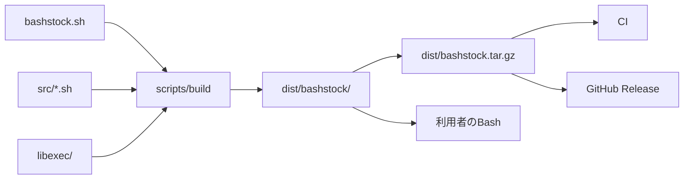
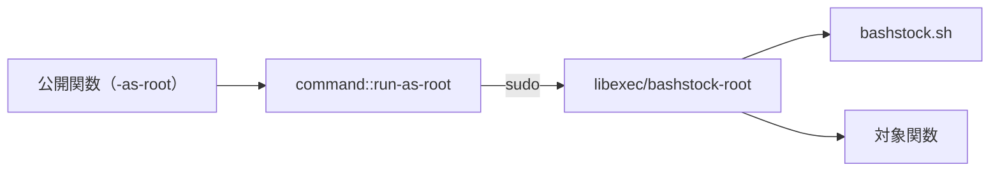

# BashStockのアーキテクチャ

この文書では、開発ソースから配布物を生成し、利用者のシェルへ読み込むまでの構成を説明します。
公開APIの契約は[ライブラリ仕様](../specifications/library.md)で定義します。

## 配布の流れ

`bashstock.sh`は利用者が`source`する入口、`src/*.sh`は関数本体、`libexec/`は権限分離が必要な内部コマンドを保持します。
`scripts/build`はこれらを`dist/bashstock/`へ複製し、GitHub Releaseへ添付する`dist/bashstock.tar.gz`を生成します。

PRと`main`へのpushでは、CIがソースから配布物を生成して検査し、ワークフローの成果物として保存します。
`v<major>.<minor>.<patch>`形式のタグでは、Releaseワークフローが同じ検査を実行し、`bashstock.tar.gz`をGitHub Releaseへ添付します。

## 配布物

配布用アーカイブは次の構成を持ちます。

| パス | 内容 |
| --- | --- |
| `bashstock/bashstock.sh` | 利用者が`source`する入口です。 |
| `bashstock/src/` | 責務ごとに関数を定義するモジュールです。 |
| `bashstock/libexec/` | 管理者権限などを分離して実行する内部コマンドです。 |
| `bashstock/LICENSE` | 配布物の利用許諾条件です。 |

`bashstock.sh`は開発ソースと配布物で同じファイルであり、`scripts/build`は`src/`と`libexec/`とともにそのまま複製します。
入口は自身のパスから`BASHSTOCK_ROOT`を求め、`${BASHSTOCK_ROOT}/src`のモジュールと`${BASHSTOCK_ROOT}/libexec/bashstock-root`を解決します。
このため、利用者は配布物を任意のディレクトリへ展開でき、カレントディレクトリや環境変数の設定を必要としません。

開発ソースと配布物の役割を分けるため、生成先の`dist/`はGitの追跡対象から外します。

## モジュールの依存順

`bashstock.sh`は、下位の機能から上位の機能へ向かう順序でモジュールを読み込みます。
上位モジュールは、表の上側にあるモジュールだけを呼び出します。

| 順序 | モジュール | 責務 |
| --- | --- | --- |
| 1 | `settings`、`console`、`number`、`string`、`regex`、`array` | 製品識別、診断、数値、文字列、正規表現、値の列を扱います。 |
| 2 | `arguments`、`completion` | 名前付き引数の検査とTab補完を扱います。 |
| 3 | `system`、`command`、`shell`、`terminal`、`path` | 実行環境、コマンド、シェル、端末、パスを扱います。 |
| 4 | `prompt`、`time`、`log` | 対話入力、時計、ログを扱います。 |
| 5 | `json`、`option`、`file` | 値の条件、選択条件、ファイル更新を扱います。 |
| 6 | `os`、OS別プロバイダー、`user` | OS差分、利用者、所有者を扱います。 |
| 7 | `aws` | IMDS、EC2、Auto Scalingを扱います。 |

## OS別プロバイダー

配布物はmacOS、Ubuntu、Fedoraの実装を`src/os-darwin.sh`、`src/os-ubuntu.sh`、`src/os-fedora.sh`として保持します。
`bashstock.sh`は読み込み時に`platform::_identifier`でOSを判定し、該当するファイルだけを読み込みます。

公開関数は`platform`名前空間の内部関数を呼び出します。
この依存方向により、呼び出し側はOSごとのコマンド名やオプションを扱わずに同じ公開APIを使用できます。

## 管理者権限の実行経路

管理者権限が必要な公開関数は、処理を自身で実行せず、`command::run-as-root`から`sudo`を介して`libexec/bashstock-root`を起動します。
`libexec/bashstock-root`はrootプロセスで`bashstock.sh`を読み込み、操作名に対応する関数を実行します。

`libexec/bashstock-root`は、実行できる操作名を`case`で明示的に対応付けます。
一覧にない操作名を受け取った場合は終了状態64を返し、rootではないプロセスから起動された場合は終了状態77を返します。

利用者が渡した環境変数`BASHSTOCK_ROOT`は読み込み先を変えません。
`libexec/bashstock-root`は自身のパスから読み込み先を決め、その値を`readonly`にしてから`bashstock.sh`を読み込みます。

## 関連文書

- [ライブラリ仕様](../specifications/library.md)
- [名前付き引数とTab補完の仕様](../specifications/named-arguments.md)
- [関数リファレンス](../reference/functions.md)
- [リリース手順](../how-to/release.md)
