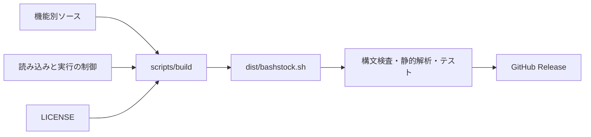

# BashStockのアーキテクチャ

BashStockは、Bashスクリプトと対話型Bashから読み込んで使う関数ライブラリです。
開発では機能ごとにソースを分割し、配布では一つの`bashstock.sh`へ結合します。

## ソースと配布ファイル

| パス | 担当する処理 |
| --- | --- |
| `src/*.sh` | 文字列、数値、パス、ファイル、時刻、利用者、AWSなどの関数を定義します。 |
| `src/os.sh`、`src/os-darwin.sh`、`src/os-ubuntu.sh`、`src/os-fedora.sh` | OSの判定と、OSごとの内部処理を定義します。 |
| `src/runtime/header.sh` | 多重読み込みを確認し、配布ファイル自身の絶対パスを記録します。 |
| `src/runtime/operations.sh` | 管理者権限のプロセス起動、操作名の対応付け、権限の確認を担当します。 |
| `src/runtime/footer.sh` | 読み込み完了の記録、または内部コマンドの実行を行います。 |
| `scripts/build` | ソースとライセンス文を結合し、`dist/bashstock.sh`を生成します。 |
| `test/` | 生成した配布ファイルの公開APIと実行時の振る舞いを検証します。 |

```mermaid
flowchart LR
  Source[機能別ソース]
  Runtime[読み込みと実行の制御]
  License[LICENSE]
  Build[scripts/build]
  File[dist/bashstock.sh]
  Checks[構文検査・静的解析・テスト]
  Release[GitHub Release]
  Source --> Build
  Runtime --> Build
  License --> Build
  Build --> File
  File --> Checks
  Checks --> Release
```

`scripts/build`は、固定の一覧と順序でソースを結合します。
すべてのOS別実装をファイルへ含め、読み込み時に該当する実装を選びます。
生成した一時ファイルの構文を確認してから、`dist/bashstock.sh`として配置します。
生成に失敗した場合は、既存の配布ファイルを保持します。

配布ファイルにはMIT Licenseの全文をコメントとして含めます。
利用者はこの一つのファイルを任意の場所へ配置でき、実行権限や付随するディレクトリを必要としません。
`dist/`は生成物として扱い、Gitの追跡対象には含めません。

## 関数の読み込みと対話設定

`source`で読み込まれた場合は、関数定義とOS別実装の選択を行い、呼び出し元へ戻ります。
読み込み時には通信、入力待ち、権限昇格、Tab補完の登録を行いません。
関数が必要とする外部コマンドは、その関数を実行する際に確認します。

Tab補完は、読み込み後に`arg::completion::register-all`を明示的に呼び出して登録します。
自動化スクリプトと対話型Bashは同じ関数を利用できます。
2回目以降の読み込みでは、最初の関数定義と利用者が設定した補完を保持します。

## 管理者権限の実行

管理者権限を使う公開関数は、読み込み時に記録した配布ファイルを別のBashプロセスで実行します。
ファイルの位置は現在のディレクトリや外部の設定値に依存しません。
配布ファイルを読み込み後に移動する場合は、新しいBashプロセスで移動先から読み込みます。

```mermaid
flowchart LR
  Public[公開関数 -as-root]
  Runner[command::run-as-root]
  Process[同じbashstock.shを別プロセスで実行]
  Dispatch[操作名・権限・引数の検査]
  Operation[ファイル操作またはOS別処理]
  Public --> Runner
  Runner --> Process
  Process --> Dispatch
  Dispatch --> Operation
```

内部の実行形式は`bash bashstock.sh --internal-root 操作名 引数`です。
実行側は固定の操作名だけを受け付け、root権限を確認し、引数を検査して対応する処理を実行します。
関数名やシェルコードを引数から評価しません。
読み込む場合と実行する場合で、ファイル操作の実装を共有します。

非対話型Bashでは、`sudo`の認証入力を待たずに権限不足を返します。
対話型Bashでは、権限昇格時に認証入力を利用できます。
配布ファイルの実行時にも、Tab補完の登録は行いません。

## 検証とリリース

CIはmacOS、Ubuntu、Fedoraでソースと生成ファイルを静的に検査し、生成ファイルを読み込んでテストします。
macOSではHomebrewのBashとシステムのBashの両方を使用します。
単独でコピーした配布ファイルについて、パスの解決、再読み込み、明示的な補完登録、管理者権限の実行を確認します。
バージョンタグの公開では、検査に成功した`bashstock.sh`をGitHub Releaseへ添付します。
自動化では、特定のバージョンのファイルを固定して利用できます。
